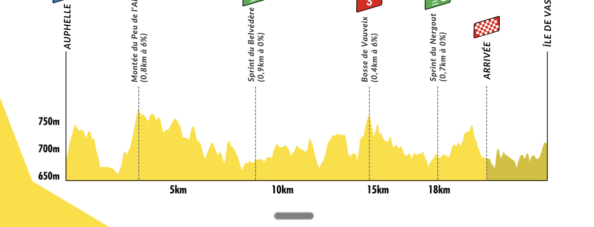
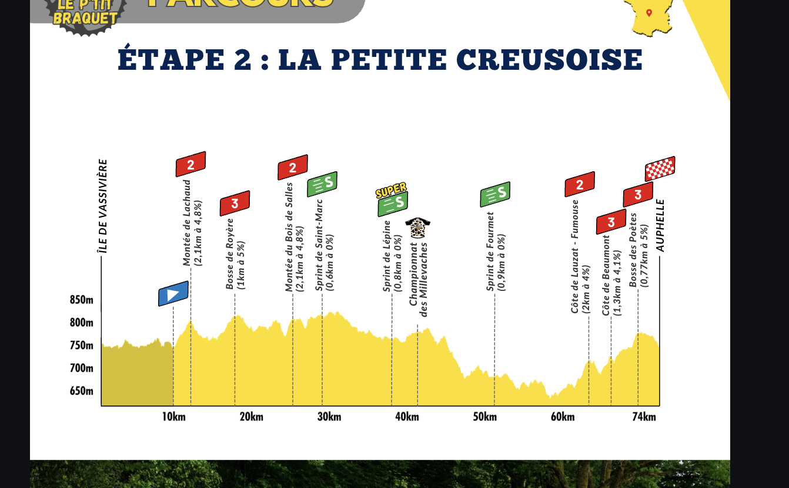
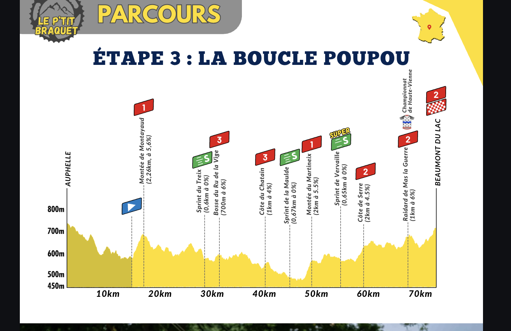
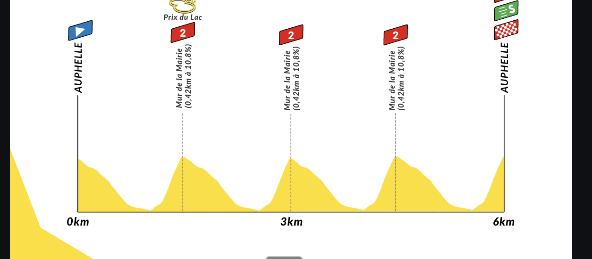
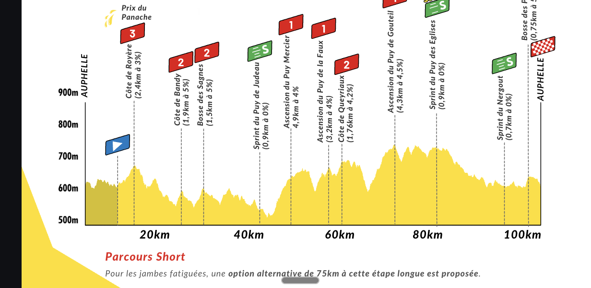

# Grand Tour de la Creuse 2026

**Dates:** 22-24 mai 2026
**Format:** 5 étapes sur 3 jours
**Total:** ~278 km / ~4430 m D+

## Résumé des étapes

| Étape | Nom | Type | Distance | D+ |
|-------|-----|------|----------|-----|
| 1 | Le Chrono du Lac | CLM équipe | 22 km | 200 m |
| 2 | La Petite Creusoise | Vallonnée | 75 km | 1050 m |
| 3 | La Boucle Poupou | Montagne | 75 km | 1250 m |
| 4 | Le Critérium de Beaumont du Lac | Critérium | 6 km | 180 m |
| 5 | La Chaîne des Puys | Montagne | 100 km | 1750 m |

## Jour 1 - Vendredi 22 mai

### Étape 1: Le Chrono du Lac
**Contre-la-montre par équipe** - 22 km / 200 m D+

Tour du lac de Vassivière. Les équipes leaders contribueront aux maillots et les 20 premiers seront chronométrés. Pause repas à l'Île du Lac.

**Maillot jaune** offert au premier du Tour.

### Étape 2: La Petite Creusoise
**Vallonnée** - 75 km / 1050 m D+

Arrivée au lac de Faux. Sprint intermédiaire pour le maillot jaune à 50m des rives. Chamonix des Millevaches au km 44.

**À noter:** Options foodtrucks pour la pause déj.

## Jour 2 - Samedi 23 mai

### Étape 3: La Boucle Poupou
**Montagne** - 75 km / 1250 m D+

Sur les terres de Raymond Poulidor (Saint-Léonard-de-Noblat). Championnat de Haute-Vienne avec plusieurs checkpoints. Montée du Martinou avec ascensions successives.

**Maillot à pois** pour le champion de Haute-Vienne.

### Étape 4: Le Critérium de Beaumont du Lac
**Critérium** - 6 km / 180 m D+

Mur de la Mairie (0.42km à **10.8%**) x4 devant la mairie. Bonifications à l'arrivée.

**Points au maillot vert:** distribués à chaque tour.

## Jour 3 - Dimanche 24 mai

### Étape 5: La Chaîne des Puys
**Montagne** - 100 km / 1750 m D+

Étape volcanique décisive. Arrivée sur les rives de Vassivière.

**Côtes principales:**
- Côte de Bandy (1.9km à 5%) ~km 20
- Bosse des Sagnes (1.5km à 5%) ~km 25
- Ascension du Puy (4.9km à 4%) ~km 45
- Ascension du Puy d'X (3.2km à 4%) ~km 55
- Côte de Queyroux (1.7km à 4.2%) ~km 60
- Ascension finale (4.3km à 4%) ~km 75

**Prix du Panache** au départ.

**Option parcours short:** 75 km disponible pour les jambes fatiguées.

## Points clés pour la préparation

### Difficultés principales
- **Étape 5** = reine avec 1750m D+ sur 100km
- **Étape 3** = 1250m D+ avec montées successives
- **Étape 4** = courte mais explosive (10.8% x4)

### Stratégie
- Jour 1: gérer, pas se cramer sur le CLM
- Jour 2: étape la plus dure (75km + 6km = 81km, 1430m D+)
- Jour 3: tenir jusqu'au bout, option short si cramé

### Altitude
- Départ/arrivée ~650m
- Points hauts ~800-900m
- Pas de haute montagne mais vallonné constant
